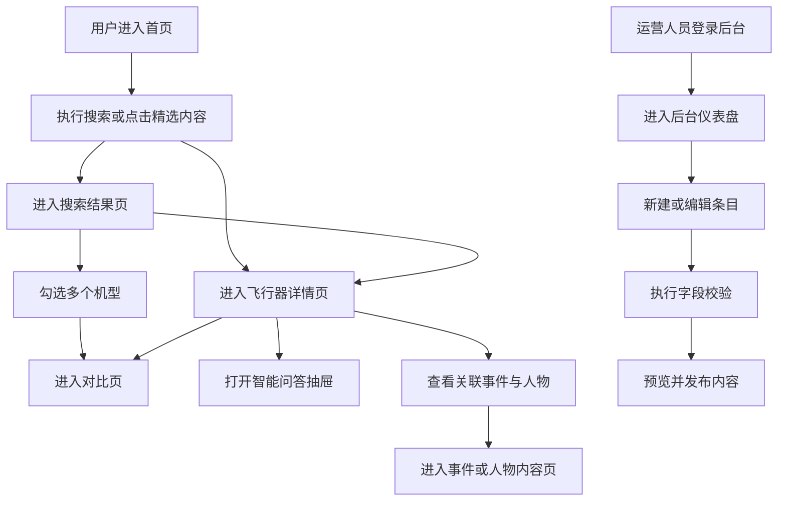

## 1. 产品概述

“飞行者图鉴”是一个面向航空科普场景的知识平台前端，服务非专业用户、航空爱好者与内容运营人员，目标是在同一产品中完成搜索、浏览、对比、科普导览与后台录入闭环。

- 解决分散航空资料难检索、难对比、难理解的问题
- 为黑客松 Demo 提供高完成度、高展示性、可持续扩展的前端产品方案

## 2. 核心功能

### 2.1 用户角色

| 角色     | 进入方式   | 核心权限                    |
| ------ | ------ | ----------------------- |
| 普通访客   | 直接访问前台 | 浏览、搜索、筛选、查看详情、对比、使用智能问答 |
| 内容运营人员 | 后台账号登录 | 新建、编辑、预览、发布航空器/事件/人物内容  |
| 管理员    | 后台账号登录 | 审核、下线、查看质量校验结果、查看审计日志   |

### 2.2 功能模块

1. **首页导览页**：品牌展示、自然语言搜索、精选机型、时间线入口、智能问答入口
2. **搜索探索页**：混合搜索结果、实体类型筛选、年代/用途/排序筛选、加入对比
3. **飞行器详情页**：机型图像、核心参数、摘要说明、关联事件、关联人物、继续学习
4. **多机型对比页**：多机型槽位、差异高亮、仅看差异、AI 对比总结
5. **事件与人物内容页**：事件时间线、人物卡片、关系联动、相关推荐
6. **后台管理页**：仪表盘、内容列表、编辑表单、媒体上传、字段校验、发布预览

### 2.3 页面明细

| 页面名称     | 模块名称      | 功能描述                     |
| -------- | --------- | ------------------------ |
| 首页导览页    | Hero 导览区  | 展示品牌主张、主搜索框、快速入口、演示路径    |
| 首页导览页    | 精选机型区     | 通过卡片展示重点机型，支持跳转详情页       |
| 首页导览页    | 亮点模块区     | 展示搜索、对比、智能问答、后台运营四大能力    |
| 搜索探索页    | 搜索栏       | 支持关键词和自然语言搜索             |
| 搜索探索页    | 筛选面板      | 支持实体类型、年代、用途、排序筛选        |
| 搜索探索页    | 结果列表      | 混合返回航空器、事件、人物并支持快速跳转     |
| 飞行器详情页   | 详情 Hero 区 | 展示封面图、标签、摘要、对比入口、问答入口    |
| 飞行器详情页   | 参数面板      | 展示尺寸、速度、航程、发动机、首飞年份等核心参数 |
| 飞行器详情页   | 关联知识区     | 展示相关事件、相关人物、相关推荐         |
| 多机型对比页   | 机型概览条     | 展示已选择机型和基础定位             |
| 多机型对比页   | 对比表       | 统一字段输出对比结果并高亮差异          |
| 多机型对比页   | AI 总结区    | 以通俗化语言总结机型差异和适用场景        |
| 事件与人物内容页 | 时间线区      | 按年代展示航空关键事件              |
| 事件与人物内容页 | 关系卡片区     | 展示相关人物、机型与知识联动           |
| 后台管理页    | 数据总览区     | 展示已发布条目、待补全字段、修复率等指标     |
| 后台管理页    | 内容编辑表单    | 新建或编辑条目，支持字段输入与即时校验      |
| 后台管理页    | 质量校验区     | 展示缺失字段、来源缺失、单位不一致等问题     |

## 3. 核心流程

普通用户从首页进入，通过搜索或精选内容进入详情页，再进一步进入对比页或事件人物联动页；智能问答作为上下文辅助入口，帮助用户继续理解与探索。后台用户通过登录进入管理界面，完成内容录入、校验、预览与发布。

## 4. 用户界面设计

### 4.1 设计风格

- 主色：深夜航海军蓝、仪表雷达青、档案米砂色
- 按钮风格：高对比胶囊按钮 + 低干扰描边按钮
- 字体：`Noto Serif SC` 用于标题，`Noto Sans SC` 用于正文，`IBM Plex Mono` 用于数据与状态标签
- 布局风格：桌面优先的沉浸式展陈布局，兼顾后台运营效率
- 图标与视觉建议：使用航空仪表、航线网格、档案卡片和时间线元素，避免通用科技模板感

### 4.2 页面设计概览

| 页面名称     | 模块名称     | UI 元素                    |
| -------- | -------- | ------------------------ |
| 首页导览页    | Hero 导览区 | 大标题、双列布局、搜索框、视觉地球体、演示路径卡 |
| 首页导览页    | 精选机型区    | 横向卡片、图像、类型标签、摘要说明        |
| 搜索探索页    | 筛选面板     | 标签筛选、下拉框、统计信息、空状态提示      |
| 搜索探索页    | 结果列表     | 类型标签、摘要、关键参数、跳转按钮        |
| 飞行器详情页   | 参数面板     | 6 宫格参数卡、可信度标签、对比入口       |
| 飞行器详情页   | 关联知识区    | 分组内容卡、问答入口、相关推荐卡         |
| 多机型对比页   | 对比表      | 固定维度表头、差异色高亮、仅看差异切换      |
| 事件与人物内容页 | 时间线区     | 节点年份标识、事件摘要、关联关系入口       |
| 后台管理页    | 仪表盘      | 数据指标卡、告警提示、审计入口          |
| 后台管理页    | 编辑表单     | 双栏表单、媒体上传位、校验结果面板、发布操作区  |

### 4.3 响应式方案

- 采用桌面优先设计
- Desktop 使用 12 栏网格与多面板布局
- Tablet 采用双栏布局，保留内容密度与阅读效率
- Mobile 使用单列布局，将对比页降级为卡片对比，将导航压缩为抽屉/顶部入口

### 4.4 无障碍要求

- 全站满足 WCAG 2.2 AA
- 键盘可达、焦点可见、表单有明确标签和错误提示
- 图像必须有 `alt` 描述，复杂图表需提供文字摘要
- 抽屉、弹层、对话框需具备语义角色和焦点管理

