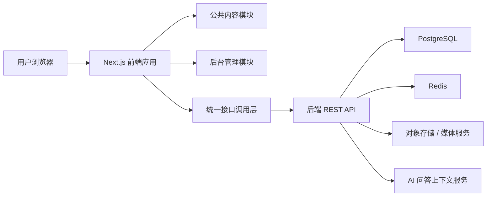
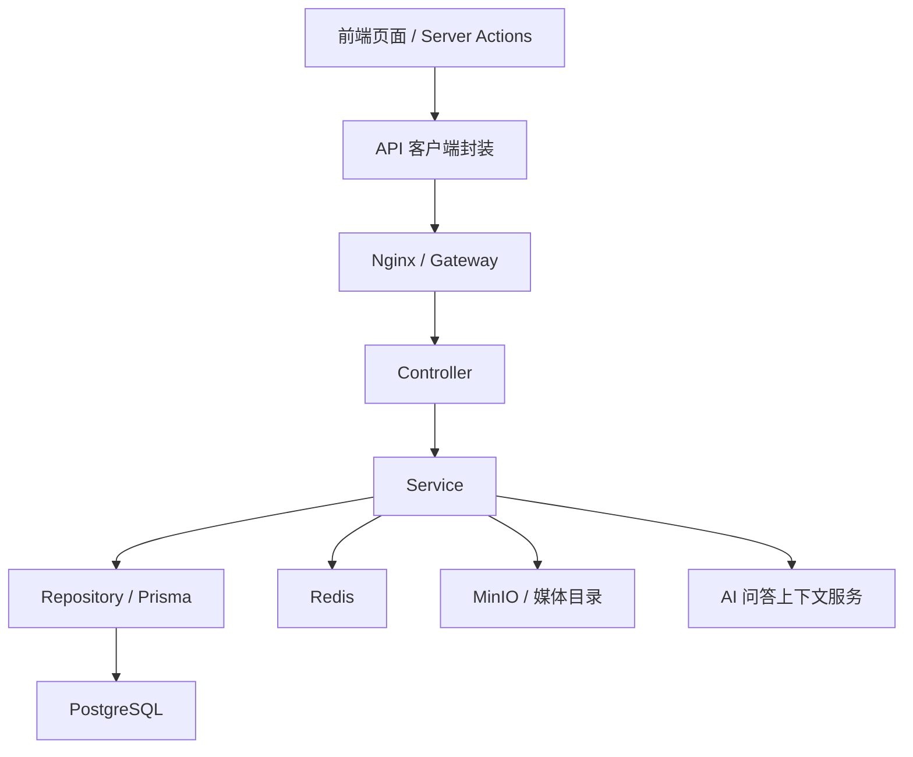
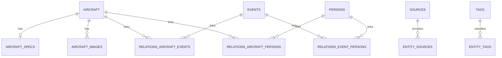

## 1. 架构设计



## 2. 技术说明

* 前端：`Next.js 15` + `React 19` + `TypeScript`

* 样式：`Tailwind CSS` + `CSS Variables` + 局部 `CSS Modules`

* 组件基础：`shadcn/ui` + `Radix UI`

* 数据请求：`TanStack Query` + `Axios`

* 本地状态：`Zustand`

* 表单与校验：`React Hook Form` + `Zod`

* 图表：`ECharts`

* 测试：`Vitest` + `Testing Library` + `Playwright` + `axe-core`

* 初始化方式：`create-next-app`

## 3. 路由定义

| 路由                          | 用途               |
| --------------------------- | ---------------- |
| `/`                         | 首页导览、精选内容、核心模块展示 |
| `/search`                   | 混合搜索结果、筛选与跳转     |
| `/aircraft`                 | 飞行器列表页           |
| `/aircraft/[slug]`          | 飞行器详情页           |
| `/compare`                  | 多机型对比页           |
| `/events`                   | 事件列表页            |
| `/events/[slug]`            | 事件详情页            |
| `/persons`                  | 人物列表页            |
| `/persons/[slug]`           | 人物详情页            |
| `/admin/login`              | 后台登录页            |
| `/admin/dashboard`          | 后台仪表盘            |
| `/admin/aircraft`           | 航空器管理列表页         |
| `/admin/aircraft/new`       | 新建航空器页           |
| `/admin/aircraft/[id]/edit` | 编辑航空器页           |
| `/admin/events`             | 事件管理页            |
| `/admin/persons`            | 人物管理页            |
| `/admin/audit-logs`         | 审计日志页            |

## 4. API 定义

### 4.1 TypeScript 类型定义

```ts
export type AircraftSpec = {
  lengthM?: number;
  wingspanM?: number;
  heightM?: number;
  maxSpeedKmh?: number;
  cruiseSpeedKmh?: number;
  rangeKm?: number;
  ceilingM?: number;
  engineType?: string;
  engineCount?: number;
  powerplantModel?: string;
  passengerCapacity?: number;
  firstFlightDate?: string;
  specSourceConfidence?: "已核实" | "待确认";
};

export type Aircraft = {
  id: string;
  slug: string;
  nameZh: string;
  nameEn?: string;
  aircraftType: string;
  manufacturer?: string;
  countryOfOrigin?: string;
  summary: string;
  description?: string;
  eraLabel?: string;
  coverImageUrl?: string;
  specs?: AircraftSpec;
};

export type SearchResultItem = {
  entityType: "aircraft" | "event" | "person";
  id: string;
  slug: string;
  title: string;
  summary: string;
  coverImageUrl?: string;
  meta?: string[];
};

export type AiAnswer = {
  answer: string;
  highlights: string[];
  comparisonTable?: Array<Record<string, string | number>>;
  recommendations: Array<{ title: string; slug: string; entityType: string }>;
  warnings: string[];
  missingFields: string[];
};
```

### 4.2 请求与响应约定

| 接口                             | 方法         | 前端用途            |
| ------------------------------ | ---------- | --------------- |
| `/api/public/aircraft`         | GET        | 获取飞行器列表、筛选、分页数据 |
| `/api/public/aircraft/:id`     | GET        | 获取飞行器详情及关联实体    |
| `/api/public/aircraft/compare` | POST       | 获取多机型统一字段对比结果   |
| `/api/public/events`           | GET        | 获取事件列表          |
| `/api/public/events/:id`       | GET        | 获取事件详情          |
| `/api/public/persons`          | GET        | 获取人物列表          |
| `/api/public/persons/:id`      | GET        | 获取人物详情          |
| `/api/public/search`           | GET        | 获取混合搜索结果        |
| `/api/public/recommendations`  | GET        | 获取相关推荐          |
| `/api/admin/auth/login`        | POST       | 后台登录            |
| `/api/admin/dashboard/summary` | GET        | 后台仪表盘统计         |
| `/api/admin/aircraft`          | POST / PUT | 新建或编辑航空器        |
| `/api/admin/events`            | POST / PUT | 新建或编辑事件         |
| `/api/admin/persons`           | POST / PUT | 新建或编辑人物         |
| `/api/admin/media/upload`      | POST       | 上传图片或媒体         |
| `/api/admin/content/validate`  | POST       | 触发字段校验          |
| `/api/admin/audit-logs`        | GET        | 获取审计日志          |

### 4.3 错误处理约定

* `401`：跳转后台登录页并保留返回地址

* `403`：进入无权限页并展示申请权限说明

* `404`：进入实体级空状态页

* `409`：提示内容已变更，需要刷新后重试

* `422`：映射到字段级校验提示

* `5xx`：进入全局错误边界并记录日志

## 5. 服务端架构图



## 6. 数据模型

### 6.1 数据模型定义



### 6.2 前端字段分层

| 层级  | 字段示例                                                                         | 用途        |
| --- | ---------------------------------------------------------------------------- | --------- |
| 列表层 | `id` `slug` `nameZh` `aircraftType` `summary` `coverImageUrl`                | 列表卡片与搜索结果 |
| 详情层 | `description` `manufacturer` `countryOfOrigin` `eraLabel`                    | 详情页叙述区    |
| 对比层 | `lengthM` `wingspanM` `maxSpeedKmh` `rangeKm` `engineType` `firstFlightDate` | 对比页表格     |
| 运营层 | `status` `publishedAt` `specSourceConfidence` `missingFields`                | 后台管理与质量校验 |

### 6.3 工程目录建议

```text
frontend-design/
  app/
    (public)/
    (admin)/
  src/
    components/
    features/
    lib/
    hooks/
    store/
    types/
    styles/
  public/
  tests/
```

### 6.4 缓存与渲染策略

* 首页、详情页：SSR + ISR

* 搜索结果：客户端查询缓存，按关键词和筛选条件缓存

* 对比结果：按机型组合缓存

* 后台列表：进入时预取，保存后失效

* 表单草稿：本地草稿缓存，避免刷新丢失

